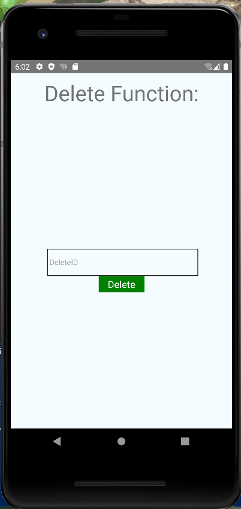
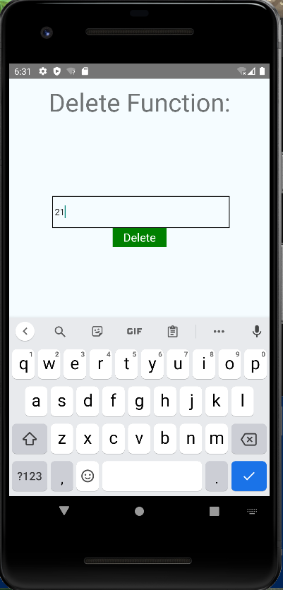
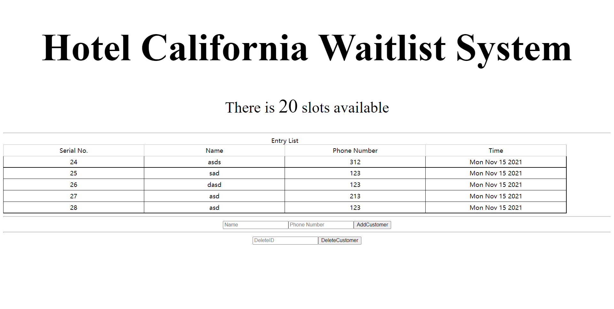
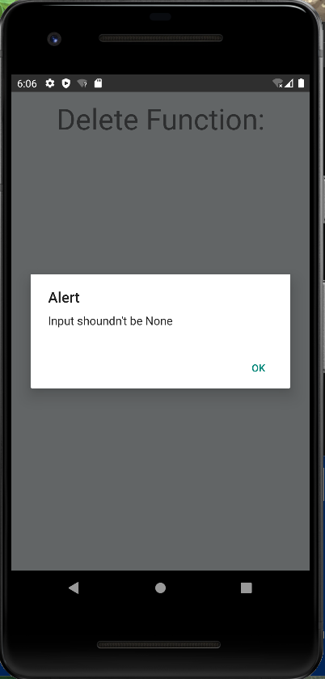
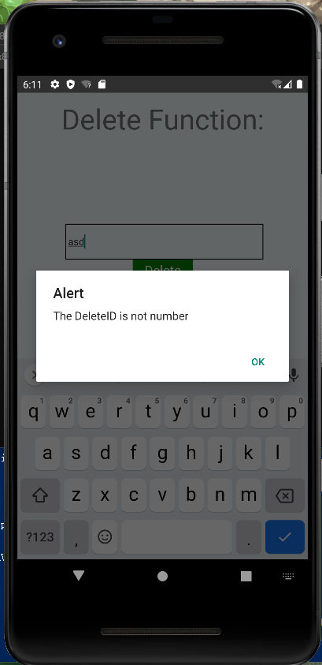

# Tutorial 6

>Student Name: Liu Zhiqi
Student Number: A0228542E
Email Address: e0674526@u.nus.edu

## Instruction

To run this project, I mainly use apollo latest module `@apollo/client`. 

Run this command to install the module:
>npm install @apollo/client graphql

## Function

In this tutorial, I mainly implemented the delete function.
The main page of this app is shown below:

To delete a customer from the server, the only thing you need to do is enter the customer ID. This app interact with the back-end server. We can see the interaction from the front-end.

Before we delete the customer, the front-end page is shown below:

If we want to delete the 21 customer from the system, we only need to enter the 21 into the `<TextInput>` and press `Delete` button.

As we can see from the front-end, the 21 customer is deleted.

### Error Detect

However, sometime system user may enter the wrong thing. If the user didn't enter anything in the `<TextInput>`, the system will alert a None input warning.

If system user didn't input the number, the system will alert a not number warning.

